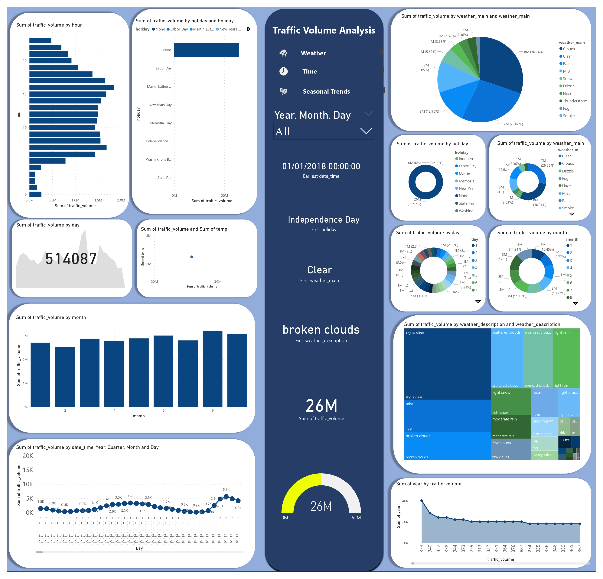

# 🚦 Traffic Volume Analysis & Visualization Using Data Mining Techniques

## 📘 Project Overview
This project investigates traffic volume patterns using the [Metro Interstate Traffic Volume Dataset](https://www.kaggle.com/datasets/damianogalassi/traffic-volume?resource=download). It combines data mining techniques with dynamic data visualization to uncover insights from hourly, weather-related, and holiday-based traffic trends.

---

## 📸 Power BI Dashboard Preview

> Visual breakdown of traffic behaviors based on time of day, holiday schedules, and weather conditions. Implemented with slicers, KPIs, and comparison charts.

---

## 🎯 Objectives

- Analyze traffic trends using temporal and environmental attributes.
- Apply data mining algorithms for pattern recognition and prediction.
- Create meaningful visualizations through Power BI dashboards.
- Derive insights to support transportation and urban planning.

---

## 🛠 Tools & Technologies

- **Microsoft Power BI** – Interactive dashboard development  
- **Weka** – Clustering & Regression analysis  
- **Dataset** – [Kaggle: Metro Interstate Traffic Volume](https://www.kaggle.com/datasets/damianogalassi/traffic-volume?resource=download)

---

## 📊 Key Findings

- **Rush Hour Peaks**: 8:00 AM and 5:00–6:00 PM
- **Weather Effect**: Clear weather = increased traffic; rainy/snowy days = lower volume
- **Holiday Drop**: Public holidays show significant dips in vehicle volume
- **Model Accuracy**:
  - Linear Regression R = 0.39
  - Key influencing features: `hour`, `temp`, `holiday`

---

## 📁 Deliverables

- `DW.pbix` – Power BI Dashboard File  
- Weka Files – Clustering & Regression Models  
- PDF Report – Includes:
  - Dataset Cleaning
  - Visual Analysis
  - Preprocessing & Feature Selection
  - Data Mining Interpretation
  - Ethical Evaluation
  - Business Intelligence Summary

---

## 👥 Team Members

- A. Deshmiga – KAHMDISM24.1F-002  
- D.H.A. Goonasekere – KAHMDISM24.1F-015  
- T.G.N.D. Jayasinghe – KAHMDISM24.1F-016  
- H.P.A.S.M. Kumari – KAHMDISM24.1F-017  
- A.M. Weerasinghe – KAHMDISM24.1F-018  

**Institution**: National Institute of Business Management (NIBM), Kandy  
**Module**: Data Warehousing & Business Intelligence  

---

## 📎 How to Use

1. Download or clone this repository.
2. Open `DW.pbix` in Microsoft Power BI to explore visuals.
3. Use Weka to load `.arff` files for clustering and regression output.
4. Refer to the project report for full documentation and evaluation.

---

> 🔍 This project demonstrates practical data science skills applied to real-world traffic problems using business intelligence tools and mining techniques.
